# 내 컴퓨터에 개발자용 '작업실' 꾸미기

* 작성된 기술 문서만 읽어도 전체 수행 내용을 파악할 수 있어야 한다.
* 터미널 조작 로그: 터미널에서 수행한 핵심 명령과 출력 결과를 기술문서(README.md)에 기록한다
* README.md만 보고도 전체 과정을 **재현**할 수 있도록 구성한다.

## 프로젝트 개요  

### 미션 목표(요약)  

* 이 과제는 **Linux CLI, Docker, Git/GitHub**를 활용하여, **개발 워크스테이션을 구축**하는 것을 목표로 한다.
* 터미널을 이용한 **파일 및 권한 관리**, **Docker**를 이용한 **컨테이너 기반 개발 환경 구축**,  
  Git/GitHub를 이용한 버전 관리와 협업 환경을 직접 구성하고 검증한다.
* **Dockerfile**을 작성하여 **커스텀 이미지**를 생성하고, **포트 매핑**을 통해 웹 서버를 실행한다.  
* **바인트 마운트**와 Docker **볼륨**을 활용하여 **소스코드 변경 반영**과 **데이터 영속성**을 확인한다.
* 각 과정의 **실행 결과**와 **로그**를 기록하여 **동일한 환경을 재현**할 수 있도록 문서화한다.
* 이를 통해 로컬 환경에 종속되지 않는 재현 가능한 개발 환경 구성 방법과 Docker의 이미지, 컨테이너 구조, git 기반 버전 관리의 기본 원리를 학습하는 것을 목표로 한다.

-> **재현성** & **개발 환경 격리성**을 갖춘 개발 환경 구축 학습이 목표

 이 과제를 마친 후, 학습자는 아래를 스스로 설명할 수 있어야 한다.
> * 절대 경로와 상대 경로의 차이를 예시를 들어 설명할 수 있다.
>  * 파일 권한의 의미(r/w/x)와 755, 644 같은 표기가 어떤 규칙으로 해석되는지 설명할 수 있다.
> * 기존 Dockerfile을 기반으로 “커스텀 이미지”를 만들 수 있다.
> * 포트 매핑이 필요한 이유를 설명할 수 있다.
> * Docker 볼륨(영속 데이터)을 설명할 수 있다.
> * Git과 GitHub의 역할 차이(로컬 버전관리 vs 원격 협업 플랫폼)를 설명할 수 있다.

## 수행 항목 체크리스트

- [x] GitHub에 제출용 Repository를 생성
- [x] Git 설정(전역 X, local로 설정함, 공용 컴퓨터라서)
- [x] .gitignore 작성
- [x] 프로젝트 폴더 구조 설계
- [x] 운영체제 확인
- [x] CPU 아키텍처 확인
- [x] 쉘 확인
- [x] 터미널 확인
- [x] Git 버전 확인
- [x] OrbStack 설치/실행/Docker 엔진 실행 확인
- [x] docker 버전/데몬(엔진)/명령어 동작 확인
- [x] 터미널 기본 조작 실습
- [x] 절대 경로와 상대 경로 실습
- [x] 파일 권한 실습
- [x] Docker Context 확인
- [x] Docker 기본 운영 명령 실습
- [x] Docker 이미지 확인
- [x] Ubuntu 이미지 다운로드
- [x] Ubuntu 컨테이너 내부 진입
- [x] 컨테이너 목록 확인
- [x] 종료된 컨테이너 다시 시작
- [x] attach와 exec 차이 확인
- [x] 컨테이너 중지 및 삭제
- [x] Docker 로그 및 리소스 확인
- [x] 실습 컨테이너 정리
- [x] Dockerfile 기반 커스텀 웹서버 만들기
- [x] 포트 매핑 실습
- [x] 바인드 마운트 변경 반영 실습
- [x] Docker 볼륨 영속성 실습
- [x] 이미지와 컨테이너 차이 정리
- [x] Docker 운영 명령 최종 기록
- [x] Git 커밋 생성
- [x] GitHub Repository 연동
- [x] VSCode와 GitHub 연동
- [x] 트러블슈팅 최소 2건 작성
- [x] 보안 및 개인정보 점검
- [x] 재현성 점검

## 과제 제출 구조 결정

* 저장소 공개 범위를 public으로 설정
* 기본 브랜치 main으로 설정
* 저장소 루트에 README.md를 생성 및 작성
* README만 보고 전체 과정을 재현 할 수 있도록 구성한다.

### 프로젝트 폴더 구조

파일 이름만 보고 내용을 알 수 있도록 작성한다.

```shell
development-workstation/
├── app/
│   └── index.html  # 웹 페이지
├── assets/ # README 이미지
├── .gitignore
├── Dockerfile
└── README.md
```

## 실행 환경 확인

| 항목 | 값 |
|------|-----|
| 운영체제 | macOS Sequoia 15.7.7 |
| 커널 | Darwin 24.6.0 |
| CPU 아키텍처 | x86_64 (Intel 64-bit) |
| 로그인 쉘 | zsh (`/bin/zsh`) |
| 실행 중인 쉘 | zsh |
| 터미널 | macOS Terminal |
| Git | 2.53.0 |

### 운영체제 확인

* 현재 운영체제를 확인한다.  

```Bash
uname -a
```

* 실행 결과

```Bash
Darwin c5r6s7.codyssey.kr 24.6.0 Darwin Kernel Version 24.6.0: Tue Apr 21 20:17:54 PDT 2026; root:xnu-11417.140.69.710.16~1/RELEASE_X86_64 x86_64
```

* macOS인 경우 운영체제 버전 확인

```Bash
sw_vers
```

* 실행 결과

```Bash
ProductName: macOS
ProductVersion: 15.7.7
BuildVersion: 24G720
```

### CPU 아키텍처 확인

```Bash
uname -m
```

* 실행 결과

```Bash
x86_64
```

### 쉘 확인

* 현재 로그인 쉘 확인

```Bash
echo $SHELL
```

* 실행 결과
  
```Bash
/bin/zsh
```

* 현재 실행 중인 쉘 확인

```Bash
ps -p $$
```

* 실행 결과
  
```Bash
  PID TTY           TIME CMD
72827 ttys000    0:00.11 -zsh
```

### 터미널 확인

* 사용 중인 터미널 프로그램을 확인
  
```Bash
echo $TERM_PROGRAM
```

* 실행 결과

```Bash
Apple_Terminal
# macOS Terminal
```

### Git 버전 확인

```Bash
git --version
```

* 실행 결과

```Bash
git version 2.53.0
```

### Docker 실행 환경 플랫폼
- Docker desktop: Docker 공식 GUI 프로그램
- OrbStack: macOS 전용
- Rancher Desktop
- Linux + Docker Engine: 리눅스에 Docker Engine만 설치해서 사용
  

과제 환경에서는 시슽템 보안 정책상 sudo 권한 사용이 제한 되어있어,
Docker 직접 설치 및 데몬 제어에 제약이 있어
과제에 명시되어 있는 대로 **OrbStack**을 활용함


OrbStack 애플리케이션을 실행 후,
내부 Docker 엔진이 실행 중인지 확인함

> **주의:** Docker Desktop과 OrbStack은 동시에 실행하지 않는다.  
> 두 프로그램을 동시에 실행하면 Docker CLI가 어느 Docker Engine에 연결되어 있는지 혼동할 수 있으므로, 실습 시에는 하나의 Docker 실행 환경만 사용한다.


## 터미너 기본 조작 실습
| 작업       | 명령어           | 의미                   |
| -------- | ------------- | -------------------- |
| 현재 위치 확인 | `pwd`         | 현재 작업 디렉터리의 절대 경로 출력 |
| 목록 확인    | `ls -la`      | 숨김 파일을 포함한 상세 목록 출력  |
| 이동       | `cd`          | 다른 디렉터리로 이동          |
| 디렉터리 생성  | `mkdir`       | 새 디렉터리 생성            |
| 파일 복사    | `cp`          | 파일 또는 디렉터리 복사        |
| 이동·이름 변경 | `mv`          | 파일 이동 또는 이름 변경       |
| 삭제       | `rm`, `rmdir` | 파일 또는 빈 디렉터리 삭제      |
| 파일 내용 확인 | `cat`         | 파일 전체 내용 출력          |
| 빈 파일 생성  | `touch`       | 내용이 없는 파일 생성         |


### 현재 위치 확인

현재 작업 디렉터리의 절대 경로를 확인한다.

#### 실행 명령

```bash
pwd
```

#### 실행 결과

```text
/Users/chl986398639863/docker-workstation
```

#### 실행 화면

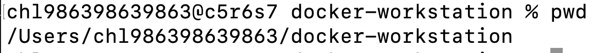

---
  
### 목록 확인(숨김 파일 포함)

#### 실행 명령

```bash 
ls -al
```

#### 실행 결과

```bash
total 24
drwxr-xr-x   8 chl986398639863  chl986398639863   256  8  4 11:10 .
drwxr-x---+ 21 chl986398639863  chl986398639863   672  8  4 09:56 ..
drwxr-xr-x  12 chl986398639863  chl986398639863   384  8  4 09:54 .git
-rw-r--r--   1 chl986398639863  chl986398639863  1059  8  4 09:54 .gitignore
drwxr-xr-x   3 chl986398639863  chl986398639863    96  8  4 09:54 app
drwxr-xr-x   5 chl986398639863  chl986398639863   160  8  4 11:10 assets
-rw-r--r--   1 chl986398639863  chl986398639863     0  8  4 09:54 Dockerfile
-rw-r--r--   1 chl986398639863  chl986398639863  6701  8  4 10:38 README.md

```

#### 실행 화면

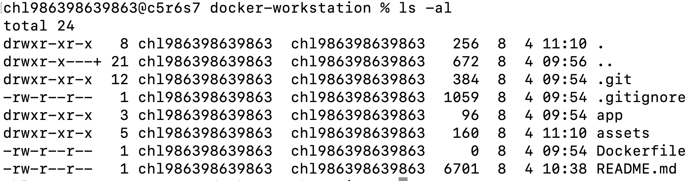

---

### 실습용 디렉터리 생성

#### 실행 명령

```bash
mkdir terminal-practice
```

#### 실행 결과

```bash
ls -al
drwxr-xr-x   2 chl986398639863  chl986398639863    64  8  4 11:27 terminal-practice
```

#### 실행 화면
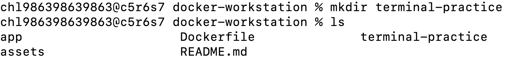

---

### 생성한 디렉터리로 이동

#### 실행 명령

```bash
cd terminal-practice
```

#### 현재 위치 확인

```bash
 pwd
/Users/chl986398639863/docker-workstation/terminal-practice
```

#### 실행 화면
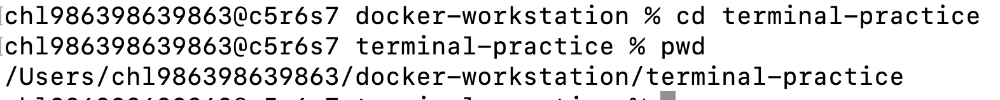

---

### 빈 파일 생성

#### 실행 명령

```Bash
# touch는 파일이 없으면 빈 파일을 생성함
# (기존 파일 있는 경우 날짜,시간 정보 변경됨)
touch practice.txt
```

#### 실행 결과

```bash
chl986398639863@c5r6s7 docker-workstation % touch practice.txt
chl986398639863@c5r6s7 docker-workstation % ls
app			Dockerfile		README.md
assets			practice.txt		terminal-practice
```

#### 실행 화면
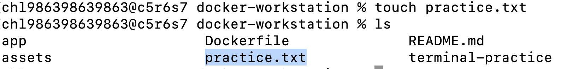

---

### 파일에 내용 작성

#### 실행 명령

```bash
# echo는 기본 문자열 출력 명령이지만,
# 리다이렉션 기호(>,>>)와 쓰면 파일에 내용을 직접씀
echo "Docker workstation 연습" > practice.txt
# >는 덮어씀, >> 는 기존 내용 뒤에 추가
echo "배고파.." >> practice.txt
```

#### 실행 결과(파일 내용 확인)

```bash
# cat 파일 내용 화면에 출력
cat practice.txt
Docker workstation 연습
배고파..
```

#### 실행 화면
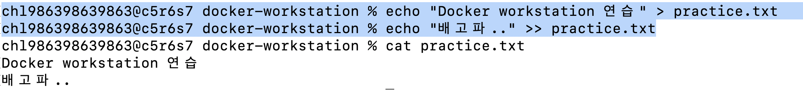

---

### 파일 복사

#### 실행 명령

```bash
#cp 원본파일 복사본파일
# 원본파일 내용을 복사본파일로 복사
cp practice.txt copycopy.txt
```

#### 실행 결과

```bash
chl986398639863@c5r6s7 docker-workstation % ls -al
total 48
drwxr-xr-x  11 chl986398639863  chl986398639863   352  8  4 12:43 .
drwxr-x---+ 21 chl986398639863  chl986398639863   672  8  4 09:56 ..
drwxr-xr-x  12 chl986398639863  chl986398639863   384  8  4 09:54 .git
-rw-r--r--   1 chl986398639863  chl986398639863  1059  8  4 09:54 .gitignore
drwxr-xr-x   3 chl986398639863  chl986398639863    96  8  4 09:54 app
drwxr-xr-x  10 chl986398639863  chl986398639863   320  8  4 12:42 assets
-rw-r--r--   1 chl986398639863  chl986398639863    38  8  4 12:43 copycopy.txt
-rw-r--r--   1 chl986398639863  chl986398639863     0  8  4 09:54 Dockerfile
-rw-r--r--   1 chl986398639863  chl986398639863    38  8  4 12:34 practice.txt
-rw-r--r--   1 chl986398639863  chl986398639863  9269  8  4 12:40 README.md
drwxr-xr-x   2 chl986398639863  chl986398639863    64  8  4 11:27 terminal-practice
chl986398639863@c5r6s7 docker-workstation % cat copycopy.txt 
Docker workstation 연습
배고파..
```

#### 실행 화면
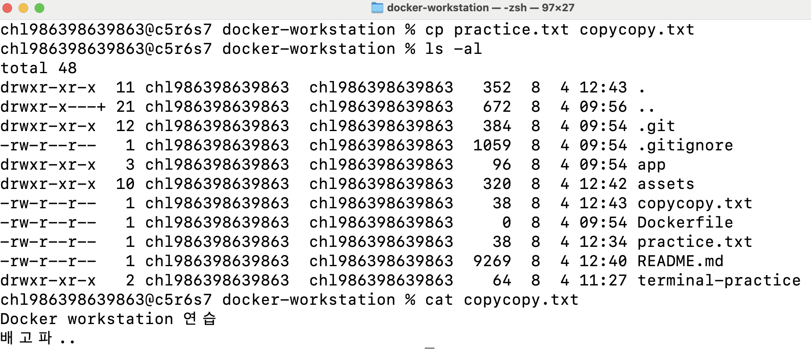

---

### 파일 이름 변경
#### 실행 명령

```bash
# 파일 이동이나 파일 변경에 쓰임
# mv 기존이름 새이름
mv copycopy.txt rename.txt
```

#### 실행 결과

```bash
chl986398639863@c5r6s7 docker-workstation % mv copycopy.txt rename.txt 
chl986398639863@c5r6s7 docker-workstation % ls    
app			Dockerfile		README.md		terminal-practice
assets			practice.txt		rename.txt
```

#### 실행 화면
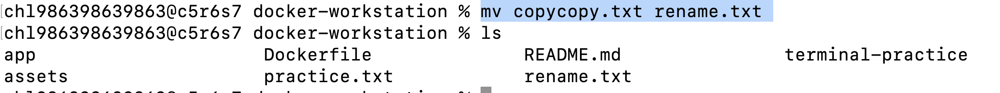

---

### 파일 이동

#### 실행 명령

```bash
# mv 이동할파일 목적디렉토리
mv rename.txt terminal-practice
```

#### 실행 결과

```bash
chl986398639863@c5r6s7 docker-workstation % mv rename.txt terminal-practice 
chl986398639863@c5r6s7 docker-workstation % cd terminal-practice 
chl986398639863@c5r6s7 terminal-practice % ls
rename.txt
```

#### 실행 화면

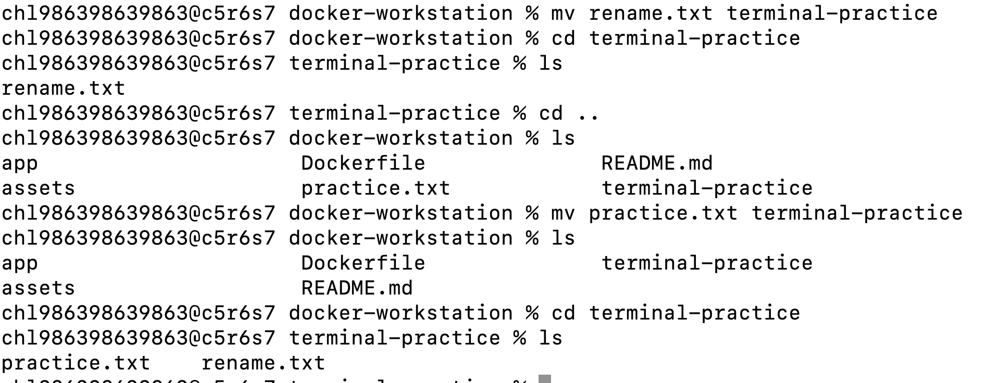

---

### 파일 삭제

#### 실행 명령

```bash
# rm은 remove의 약자
# -rf 옵션 주면 폴더 + 하위 파일까지 전부 삭제
rm terminal-practice/rename.txt
```

#### 실행 결과

```bash
chl986398639863@c5r6s7 docker-workstation % rm terminal-practice/rename.txt 
chl986398639863@c5r6s7 docker-workstation % ls -al terminal-practice 
total 8
drwxr-xr-x  3 chl986398639863  chl986398639863   96  8  4 13:02 .
drwxr-xr-x  9 chl986398639863  chl986398639863  288  8  4 12:54 ..
-rw-r--r--  1 chl986398639863  chl986398639863   38  8  4 12:34 practice.txt
```

#### 실행화면
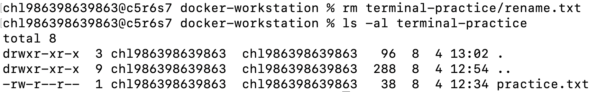

---

## Git 설정 및 GitHub 연동

### 실행 명령
```bash
# 공용 컴퓨터라서 로컬(Local)설정으로만 함(전역으로 안하고,,)
git config user.name "GitHub닉네임"
git config user.email "GitHub이메일"

#확인
git config --list --local

# 기본 브랜치 설정 명령: 앞으로 git init으로 새 저장소 만들때 기본 브랜치를 main으로 설정
#(사실 안해도 됨)
git config init.defaultBranch main

# 과제 제출 후 (프로젝트 삭제하면 로컬 설정도 같이 제거됨)
rm -rf docker-workstation
```

#### 실행 화면
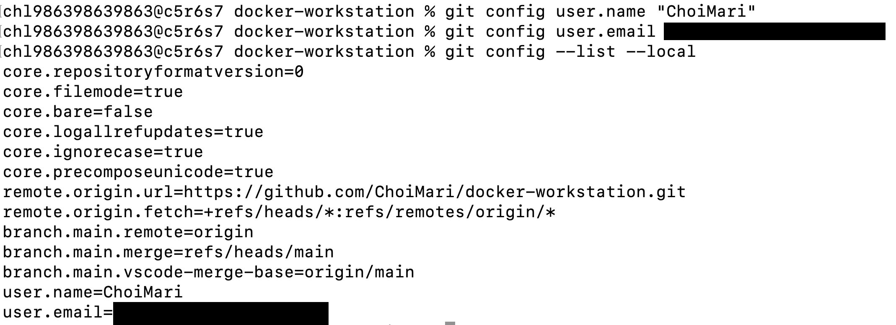

---

## 절대 경로와 상대 경로 
절대 경로와 상대 경로의 차이를 예시를 들어 설명하기

### 절대 경로
절대 경로는 루트 디렉터리(/)부터 시작하는 전체 경로를 의미함
현재 작업 위치와 관계없이 항상 동일한 위치를 가리킴
예) 프로젝트가 다음 위치에 있다면
```text
/Users/chl986398639863/docker-workstation
```

`README.md`의 절대 경로는

```text
/Users/chl986398639863/docker-workstation/README.md
```

이다.

### 상대경로
상대 경로는 현재 작업 디렉터리를 기준으로 표현하는 경로
현재 위치가

```text
/Users/chl986398639863/docker-workstation
```

이라면

`README.md`는

```text
./README.md
```
이고,

`app/index.html`은

```text
./app/index.html
```

으로 표현할 수 있다.

### 실습

- 현재 위치 확인

```bash
pwd
```

- 실행 결과

```text
/Users/chl986398639863/docker-workstation
```

- 현재 위치를 기준으로 `app` 디렉터리로 이동

```bash
cd app
```

- 현재 위치 확인

```bash
pwd
```

- 실행 결과

```text
/Users/chl986398639863/docker-workstation/app
```

- 상위 디렉터리로 이동

```bash
cd ..
```

- `..`은 상위 디렉터리를 의미한다.

---

### 절대 경로와 상대 경로 비교

| 구분 | 절대 경로 | 상대 경로 |
|------|----------|----------|
| 기준 | 루트 디렉터리(`/`) | 현재 작업 디렉터리 |
| 시작 위치 | `/`부터 시작 | 현재 위치부터 시작 |
| 예시 | `/Users/chl986398639863/docker-workstation/app/index.html` | `app/index.html` |
| 특징 | 항상 동일한 위치를 가리킨다. | 현재 위치에 따라 경로가 달라진다. |

---

