# 내 컴퓨터에 개발자용 '작업실' 꾸미기

* 작성된 기술 문서만 읽어도 전체 수행 내용을 파악할 수 있어야 한다.
* 터미널 조작 로그: 터미널에서 수행한 핵심 명령과 출력 결과를 기술문서(README.md)에 기록한다
* README.md만 보고도 전체 과정을 **재현**할 수 있도록 구성한다.

---

## 평가 목차
**기능 동작 검증**
- [터미널에서 기본 명령어로 폴더/파일 생성,이동,삭제 수행 흔적이 았는가?](#eval-terminal)
- [파일 권한 변경 결과가 확인되는가?](#eval-permission)
- [`docker --version`이 출력되고, Docker가 동작 가능한 상태인가?](#eval-docker-status)
- [`Docker run hello-world`가 정상 실행되는가?](#eval-hello-world)
- [이미지/컨테이너 목록 확인 및 정리 흔적이 있는가?](#eval-docker-management)
- [Dockerfile로 이미지 빌드가 가능한가?](#eval-docker-build)
- [매핑된 포트로 접속이 가능한가?](#eval-port-mapping)
- [Docker 볼륨 데이터가 컨테이너 삭제 후에도 유지되는가?](#eval-volume)
- [Git 설정 및 GitHub 연동이 확인 되는가?](#eval-git)

**동작 구조 설계**
- [프로젝트 디렉토리 구조를 어떤 기준으로 구성했는지 설명할 수 있는가?](#eval-project-structure)
- [포트](#eval-volume) / [볼륨](#eval-port-mapping) 설정을 어떤 방식으로 재현 가능하게 정리했는지 설명할 수 있는가?

**핵심 기술 원리 적용**
- [이미지와 컨테이너의 차이를 "빌드/실행/변경" 관점에서 구분해 설명할 수 있는가?](#eval-image-container)
- [컨테이너 내부 포트로 직접 접속할 수 없는 이유와 필요한 이유를 설명할 수 있는가?](#eval-port-concept)
- [절대 경로/상대 경로를 어떤 상황에서 선택하는지 설명할 수 있는가?](#eval-path)
- [파일 권한 숫자 표기(예: 755, 644)가 어떤 규칙으로 결정되는지 설명할 수 있는가?](#eval-permission-number)

**심층 인터뷰**
- [호스트 포트가 이미 사용중이라 포트 매핑이 실패한다면, 어떤 순서로 원인을 진단할지 설명할 수 있는가?](#eval-port-troubleshooting)
- [컨테이너 삭제 후 데이터가 사라진 경험이 있다면, 이를 방지하기 위한 대안을 설명할 수 있는가?](#eval-data-loss)
- [이 미션에서 가장 어려웠던 지점과, 해결 과정(가설->확인->조치)을 근거와 함께 설명할 수 있는가?](#eval-troubleshooting)

---

## 프로젝트 개요  
### 미션 목표(요약)  

* 이 과제는 **Linux CLI, Docker, Git/GitHub**를 활용하여, **개발 워크스테이션을 구축**하는 것을 목표로 한다.
* 터미널을 이용한 **파일 및 권한 관리**, **Docker**를 이용한 **컨테이너 기반 개발 환경 구축**,  
  Git/GitHub를 이용한 버전 관리와 협업 환경을 직접 구성하고 검증한다.
* **Dockerfile**을 작성하여 **커스텀 이미지**를 생성하고, **포트 매핑**을 통해 웹 서버를 실행한다.  
* **바인드 마운트**와 Docker **볼륨**을 활용하여 **소스코드 변경 반영**과 **데이터 영속성**을 확인한다.
* 각 과정의 **실행 결과**와 **로그**를 기록하여 **동일한 환경을 재현**할 수 있도록 문서화한다.
* 이를 통해 로컬 환경에 종속되지 않는 재현 가능한 개발 환경 구성 방법과 Docker의 이미지, 컨테이너 구조, git 기반 버전 관리의 기본 원리를 학습하는 것을 목표로 한다.

-> **재현성** & **개발 환경 격리성**을 갖춘 개발 환경 구축 학습이 목표

 이 과제를 마친 후, 학습자는 아래를 스스로 설명할 수 있어야 한다.
> * 절대 경로와 상대 경로의 차이를 예시를 들어 설명할 수 있다.
>  * 파일 권한의 의미(r/w/x)와 755, 644 같은 표기가 어떤 규칙으로 해석되는지 설명할 수 있다.
> * 기존 Dockerfile을 기반으로 “커스텀 이미지”를 만들 수 있다.
> * 포트 매핑이 필요한 이유를 설명할 수 있다.
> * Docker 볼륨(영속 데이터)을 설명할 수 있다.
> * Git과 GitHub의 역할 차이(로컬 버전관리 vs 원격 협업 플랫폼)를 설명할 수 있다.

## 수행 항목 체크리스트

- [x] GitHub에 제출용 Repository를 생성
- [x] Git 설정(전역 X, local로 설정함, 공용 컴퓨터라서)
- [x] .gitignore 작성
- [x] 프로젝트 폴더 구조 설계
- [x] 운영체제 확인
- [x] CPU 아키텍처 확인
- [x] 쉘 확인
- [x] 터미널 확인
- [x] Git 버전 확인
- [x] OrbStack 설치/실행/Docker 엔진 실행 확인
- [x] docker 버전/데몬(엔진)/명령어 동작 확인
- [x] 터미널 기본 조작 실습
- [x] 절대 경로와 상대 경로 실습
- [x] 파일 권한 실습
- [x] Docker Context 확인
- [x] Docker 기본 운영 명령 실습
- [x] Docker 이미지 확인
- [x] Ubuntu 이미지 다운로드
- [x] Ubuntu 컨테이너 내부 진입
- [x] 컨테이너 목록 확인
- [x] 종료된 컨테이너 다시 시작
- [x] attach와 exec 차이 확인
- [x] 컨테이너 중지 및 삭제
- [x] Docker 로그 및 리소스 확인
- [x] 실습 컨테이너 정리
- [x] Dockerfile 기반 커스텀 웹서버 만들기
- [x] 포트 매핑 실습
- [x] 바인드 마운트 변경 반영 실습
- [x] Docker 볼륨 영속성 실습
- [x] 이미지와 컨테이너 차이 정리
- [x] Docker 운영 명령 최종 기록
- [x] Git 커밋 생성
- [x] GitHub Repository 연동
- [x] VSCode와 GitHub 연동
- [x] 트러블슈팅 최소 2건 작성
- [x] 보안 및 개인정보 점검
- [x] 재현성 점검

## 과제 제출 구조 결정

* 저장소 공개 범위를 public으로 설정
* 기본 브랜치 main으로 설정
* 저장소 루트에 README.md를 생성 및 작성
* README만 보고 전체 과정을 재현 할 수 있도록 구성한다.

<a id="eval-project-structure"></a>

### 프로젝트 폴더 구조

프로젝트 구조는 웹 소스, 문서 증거를 역할별로 분리하는 기준으로 구성함

```shell
development-workstation/
├── app/ # Nginx가 제공할 정적 웹 소스 저장 디렉터리
│   └── index.html  # 웹 페이지
├── assets/ # README에 첨부할 스크린샷
├── .gitignore # git이 추적 제외 목록
├── Dockerfile # 커스텀 이미지 제작 설명서
├── .dockerignore # docker 이미지 빌드에 포함시키지 않을 목록
└── README.md # 실습 절차 기록
```

## 실행 환경 확인

| 항목 | 값 |
|------|-----|
| 운영체제 | macOS Sequoia 15.7.7 |
| 커널 | Darwin 24.6.0 |
| CPU 아키텍처 | x86_64 (Intel 64-bit) |
| 로그인 쉘 | zsh (`/bin/zsh`) |
| 실행 중인 쉘 | zsh |
| 터미널 | macOS Terminal |
| Git | 2.53.0 |

### 운영체제 확인

* 현재 운영체제를 확인한다.  

```Bash
uname -a
```

* 실행 결과

```Bash
Darwin c5r6s7.codyssey.kr 24.6.0 Darwin Kernel Version 24.6.0: Tue Apr 21 20:17:54 PDT 2026; root:xnu-11417.140.69.710.16~1/RELEASE_X86_64 x86_64
```

* macOS인 경우 운영체제 버전 확인

```Bash
sw_vers
```

* 실행 결과

```Bash
ProductName: macOS
ProductVersion: 15.7.7
BuildVersion: 24G720
```

### CPU 아키텍처 확인

```Bash
uname -m
```

* 실행 결과

```Bash
x86_64
```

### 쉘 확인

* 현재 로그인 쉘 확인

```Bash
echo $SHELL
```

* 실행 결과
  
```Bash
/bin/zsh
```

* 현재 실행 중인 쉘 확인

```Bash
ps -p $$
```

* 실행 결과
  
```Bash
  PID TTY           TIME CMD
72827 ttys000    0:00.11 -zsh
```

### 터미널 확인

* 사용 중인 터미널 프로그램을 확인
  
```Bash
echo $TERM_PROGRAM
```

* 실행 결과

```Bash
Apple_Terminal
# macOS Terminal
```

### Git 버전 확인

```Bash
git --version
```

* 실행 결과

```Bash
git version 2.53.0
```

### Docker 실행 환경 플랫폼
- Docker desktop: Docker 공식 GUI 프로그램
- OrbStack: macOS 전용
- Rancher Desktop
- Linux + Docker Engine: 리눅스에 Docker Engine만 설치해서 사용
  

과제 환경에서는 시스템 보안 정책상 sudo 권한 사용이 제한 되어있어,
Docker 직접 설치 및 데몬 제어에 제약이 있어
과제에 명시되어 있는 대로 **OrbStack**을 활용함


OrbStack 애플리케이션을 실행 후,
내부 Docker 엔진이 실행 중인지 확인함

> **주의:** Docker Desktop과 OrbStack은 동시에 실행하지 않는다.  
> 두 프로그램을 동시에 실행하면 Docker CLI가 어느 Docker Engine에 연결되어 있는지 혼동할 수 있으므로, 실습 시에는 하나의 Docker 실행 환경만 사용한다.

<a id="eval-terminal"></a>

## 터미널 기본 조작 실습

| 작업       | 명령어           | 의미                   |
| -------- | ------------- | -------------------- |
| 현재 위치 확인 | `pwd`         | 현재 작업 디렉터리의 절대 경로 출력 |
| 목록 확인    | `ls -la`      | 숨김 파일을 포함한 상세 목록 출력  |
| 이동       | `cd`          | 다른 디렉터리로 이동          |
| 디렉터리 생성  | `mkdir`       | 새 디렉터리 생성            |
| 파일 복사    | `cp`          | 파일 또는 디렉터리 복사        |
| 이동·이름 변경 | `mv`          | 파일 이동 또는 이름 변경       |
| 삭제       | `rm`, `rmdir` | 파일 또는 빈 디렉터리 삭제      |
| 파일 내용 확인 | `cat`         | 파일 전체 내용 출력          |
| 빈 파일 생성  | `touch`       | 내용이 없는 파일 생성         |


### 현재 위치 확인

현재 작업 디렉터리의 절대 경로를 확인한다.

#### 실행 명령

```bash
pwd
```

#### 실행 결과

```text
/Users/chl986398639863/docker-workstation
```

#### 실행 화면


---
  
### 목록 확인(숨김 파일 포함)

#### 실행 명령

```bash 
ls -al
```

#### 실행 결과

```bash
total 24
drwxr-xr-x   8 chl986398639863  chl986398639863   256  8  4 11:10 .
drwxr-x---+ 21 chl986398639863  chl986398639863   672  8  4 09:56 ..
drwxr-xr-x  12 chl986398639863  chl986398639863   384  8  4 09:54 .git
-rw-r--r--   1 chl986398639863  chl986398639863  1059  8  4 09:54 .gitignore
drwxr-xr-x   3 chl986398639863  chl986398639863    96  8  4 09:54 app
drwxr-xr-x   5 chl986398639863  chl986398639863   160  8  4 11:10 assets
-rw-r--r--   1 chl986398639863  chl986398639863     0  8  4 09:54 Dockerfile
-rw-r--r--   1 chl986398639863  chl986398639863  6701  8  4 10:38 README.md

```

#### 실행 화면


---

### 실습용 디렉터리 생성

#### 실행 명령

```bash
mkdir terminal-practice
```

#### 실행 결과

```bash
ls -al
drwxr-xr-x   2 chl986398639863  chl986398639863    64  8  4 11:27 terminal-practice
```

#### 실행 화면


---

### 생성한 디렉터리로 이동

#### 실행 명령

```bash
cd terminal-practice
```

#### 현재 위치 확인

```bash
 pwd
/Users/chl986398639863/docker-workstation/terminal-practice
```

#### 실행 화면


---

### 빈 파일 생성

#### 실행 명령

```Bash
# touch는 파일이 없으면 빈 파일을 생성함
# (기존 파일 있는 경우 날짜,시간 정보 변경됨)
touch practice.txt
```

#### 실행 결과

```bash
chl986398639863@c5r6s7 docker-workstation % touch practice.txt
chl986398639863@c5r6s7 docker-workstation % ls
app			Dockerfile		README.md
assets			practice.txt		terminal-practice
```

#### 실행 화면


---

### 파일에 내용 작성

#### 실행 명령

```bash
# echo는 기본 문자열 출력 명령이지만,
# 리다이렉션 기호(>,>>)와 쓰면 파일에 내용을 직접씀
echo "Docker workstation 연습" > practice.txt
# >는 덮어씀, >> 는 기존 내용 뒤에 추가
echo "배고파.." >> practice.txt
```

#### 실행 결과(파일 내용 확인)

```bash
# cat 파일 내용 화면에 출력
cat practice.txt
Docker workstation 연습
배고파..
```

#### 실행 화면


---

### 파일 복사

#### 실행 명령

```bash
#cp 원본파일 복사본파일
# 원본파일 내용을 복사본파일로 복사
cp practice.txt copycopy.txt
```

#### 실행 결과

```bash
chl986398639863@c5r6s7 docker-workstation % ls -al
total 48
drwxr-xr-x  11 chl986398639863  chl986398639863   352  8  4 12:43 .
drwxr-x---+ 21 chl986398639863  chl986398639863   672  8  4 09:56 ..
drwxr-xr-x  12 chl986398639863  chl986398639863   384  8  4 09:54 .git
-rw-r--r--   1 chl986398639863  chl986398639863  1059  8  4 09:54 .gitignore
drwxr-xr-x   3 chl986398639863  chl986398639863    96  8  4 09:54 app
drwxr-xr-x  10 chl986398639863  chl986398639863   320  8  4 12:42 assets
-rw-r--r--   1 chl986398639863  chl986398639863    38  8  4 12:43 copycopy.txt
-rw-r--r--   1 chl986398639863  chl986398639863     0  8  4 09:54 Dockerfile
-rw-r--r--   1 chl986398639863  chl986398639863    38  8  4 12:34 practice.txt
-rw-r--r--   1 chl986398639863  chl986398639863  9269  8  4 12:40 README.md
drwxr-xr-x   2 chl986398639863  chl986398639863    64  8  4 11:27 terminal-practice
chl986398639863@c5r6s7 docker-workstation % cat copycopy.txt 
Docker workstation 연습
배고파..
```

#### 실행 화면


---

### 파일 이름 변경
#### 실행 명령

```bash
# 파일 이동이나 파일 변경에 쓰임
# mv 기존이름 새이름
mv copycopy.txt rename.txt
```

#### 실행 결과

```bash
chl986398639863@c5r6s7 docker-workstation % mv copycopy.txt rename.txt 
chl986398639863@c5r6s7 docker-workstation % ls    
app			Dockerfile		README.md		terminal-practice
assets			practice.txt		rename.txt
```

#### 실행 화면


---

### 파일 이동

#### 실행 명령

```bash
# mv 이동할파일 목적디렉토리
mv rename.txt terminal-practice
```

#### 실행 결과

```bash
chl986398639863@c5r6s7 docker-workstation % mv rename.txt terminal-practice 
chl986398639863@c5r6s7 docker-workstation % cd terminal-practice 
chl986398639863@c5r6s7 terminal-practice % ls
rename.txt
```

#### 실행 화면


---

### 파일 삭제

#### 실행 명령

```bash
# rm은 remove의 약자
# -rf 옵션 주면 폴더 + 하위 파일까지 전부 삭제
rm terminal-practice/rename.txt
```

#### 실행 결과

```bash
chl986398639863@c5r6s7 docker-workstation % rm terminal-practice/rename.txt 
chl986398639863@c5r6s7 docker-workstation % ls -al terminal-practice 
total 8
drwxr-xr-x  3 chl986398639863  chl986398639863   96  8  4 13:02 .
drwxr-xr-x  9 chl986398639863  chl986398639863  288  8  4 12:54 ..
-rw-r--r--  1 chl986398639863  chl986398639863   38  8  4 12:34 practice.txt
```

#### 실행화면


---

<a id="eval-git"></a>

## Git 설정 및 GitHub 연동

### 실행 명령
```bash
# 공용 컴퓨터라서 로컬(Local)설정으로만 함(전역으로 안하고,,)
git config user.name "GitHub닉네임"
git config user.email "GitHub이메일"

#확인
git config --list --local

# 기본 브랜치 설정 명령: 앞으로 git init으로 새 저장소 만들때 기본 브랜치를 main으로 설정
#(사실 안해도 됨)
git config init.defaultBranch main

# 과제 제출 후 (프로젝트 삭제하면 로컬 설정도 같이 제거됨)
rm -rf docker-workstation
```

#### 실행 화면


```bash
git remote -v
origin	https://github.com/ChoiMari/docker-workstation.git (fetch)
origin	https://github.com/ChoiMari/docker-workstation.git (push)
```

---

## VSCode와 GitHub 연동
* VSCode 좌측 Source Control 메뉴
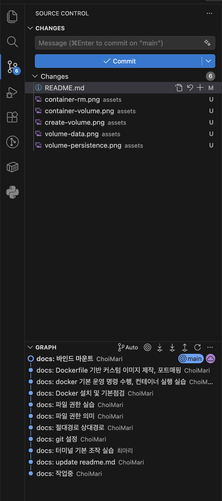

---

<a id="eval-path"></a>

## 절대 경로와 상대 경로 
절대 경로와 상대 경로의 차이를 예시를 들어 설명하기

### 절대 경로
절대 경로는 루트 디렉터리(/)부터 시작하는 전체 경로를 의미함
현재 작업 위치와 관계없이 항상 동일한 위치를 가리킴
예) 프로젝트가 다음 위치에 있다면
```text
/Users/chl986398639863/docker-workstation
```

`README.md`의 절대 경로는

```text
/Users/chl986398639863/docker-workstation/README.md
```

이다.

### 상대경로
상대 경로는 현재 작업 디렉터리를 기준으로 표현하는 경로
현재 위치가

```text
/Users/chl986398639863/docker-workstation
```

이라면

`README.md`는

```text
./README.md
```
이고,

`app/index.html`은

```text
./app/index.html
```

으로 표현할 수 있다.

### 실습

- 현재 위치 확인

```bash
pwd
```

- 실행 결과

```text
/Users/chl986398639863/docker-workstation
```

- 현재 위치를 기준으로 `app` 디렉터리로 이동

```bash
cd app
```

- 현재 위치 확인

```bash
pwd
```

- 실행 결과

```text
/Users/chl986398639863/docker-workstation/app
```

- 상위 디렉터리로 이동

```bash
cd ..
```

- `..`은 상위 디렉터리를 의미한다.

---

### 경로 선택 기준
- 현재 위치와 관계없이 항상 같은 파일을 지정해야 되는 경우 절대 경로 사용
- 같은 프로젝트 안에서 파일을 참조할 때는 다른 환경에서도 재사용 하기 쉬운 상대 경로 사용 


---

### 절대 경로와 상대 경로 비교

| 구분 | 절대 경로 | 상대 경로 |
|------|----------|----------|
| 기준 | 루트 디렉터리(`/`) | 현재 작업 디렉터리 |
| 시작 위치 | `/`부터 시작 | 현재 위치부터 시작 |
| 예시 | `/Users/chl986398639863/docker-workstation/app/index.html` | `app/index.html` |
| 특징 | 항상 동일한 위치를 가리킨다. | 현재 위치에 따라 경로가 달라진다. |

---

<a id="eval-permission"></a>

## 파일 권한
Linux와 macOS에서는 파일과 디렉터리에 권한이 존재하며, 이를 통해 누가 파일을 읽고, 수정, 실행할 수 있는지 제어함

### 권한의 종류

| 권한 | 의미 | 파일 | 디렉터리 |
|------|------|------|----------|
| `r` (Read) | 읽기 권한 | 파일 내용을 읽을 수 있다. | 디렉터리 목록을 확인할 수 있다. |
| `w` (Write) | 쓰기 권한 | 파일 내용을 수정할 수 있다. | 파일 생성, 삭제, 이름 변경이 가능하다. |
| `x` (Execute) | 실행 권한 | 프로그램이나 스크립트를 실행할 수 있다. | 디렉터리 안으로 이동(`cd`)할 수 있다. |
|-|권한 없음|해당 권한이 부여되지 않음||

### 권한 확인

```bash
ls -l
```
* 실행 결과

```bash
total 32
drwxr-xr-x   3 chl986398639863  chl986398639863     96  8  4 09:54 app
drwxr-xr-x  15 chl986398639863  chl986398639863    480  8  4 13:14 assets
-rw-r--r--   1 chl986398639863  chl986398639863      0  8  4 09:54 Dockerfile
-rw-r--r--   1 chl986398639863  chl986398639863  15399  8  4 13:48 README.md
```

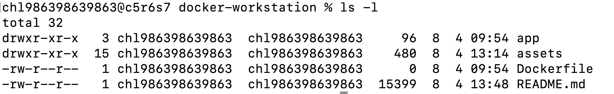

### 세부 구조 분석
총 10자리 문자는 크게 4구역으로 나뉜다
1 자리는 파일(-) 또는 디렉터리(d)의 권한을 의미
2~4 소유자 권한
5~7 그룹권한
8~10 기타사용자(Other)

```text
-rw-r--r--
│  │  │  │
│  │  │  └─ 다른 사용자(Other)
│  │  └──── 그룹(Group)
│  └─────── 소유자(User)
│
└────────── 파일 종류
```

파일 종류

- `-` : 일반 파일
- `d` : 디렉터리
- `l` : 심볼릭 링크(바로가기 개념)

<a id="eval-permission-number"></a>

### 숫자 권한(755, 644)의 의미

권한은 숫자로도 표현할 수 있으며, 각 권한은 다음 값을 가진다.
실무에서 가장 흔하게 부여하는 권한 숫자는
755, 644

| 권한 | 값 |
|------|---:|
| `r` | 4 |
| `w` | 2 |
| `x` | 1 |

필요한 권한 값을 더하여 하나의 숫자로 표현한다.

| 권한 | 계산 | 숫자 |
|------|------|----:|
| `rwx` | 4 + 2 + 1 | 7 |
| `rw-` | 4 + 2 | 6 |
| `r-x` | 4 + 1 | 5 |
| `r--` | 4 | 4 |
| `---` | 0 | 0 |

---

### 755 권한

```text
755
│ │ └─ Other : 5 = r-x
│ └── Group : 5 = r-x
└──── User  : 7 = rwx
```

권한 문자열로 표현하면

```text
rwxr-xr-x
```

의미

- 소유자: 읽기, 쓰기, 실행 가능
- 그룹: 읽기, 실행 가능
- 기타 사용자: 읽기, 실행 가능

주로 **디렉터리**나 **실행 파일**에 사용한다.

---

### 644 권한

```text
644
│ │ └─ Other : 4 = r--
│ └── Group : 4 = r--
└──── User  : 6 = rw-
```

권한 문자열로 표현하면

```text
rw-r--r--
```

의미

- 소유자: 읽기, 쓰기 가능
- 그룹: 읽기만 가능
- 기타 사용자: 읽기만 가능

주로 실행할 필요가 없는 거의 모든 **일반 파일, 소스코드**에 사용한다.

---

### 실습
* `chmod`는 숫자 방식과 기호 방식 지원함
```bash
# chmod [옵션] [권한설정] [대상파일 또는 디렉토리]
# 숫자 방식
touch test.sh # 빈 파일 생성
chmod 755 test.sh # 권한 변경
ls -l test.sh # 확인

# 기호 방식
# chmod 누구연산자권한 파일명
# u 소유자, g 그룹, o 기타사용자, a 모두
# 추가(+), 제거(-), 교체(=)
chmod u+x test.sh # 소유자에게 실행(x)권한 추가
chmod g-x test.sh # 그룹 실행(x) 권한 제거
chmod u=rw test.sh # 소유자 권한을 rw로 교체

chmod u+x test.sh
      │││
      ││└─ 실행 권한
      │└── 추가
      └── 소유자에게
```
 
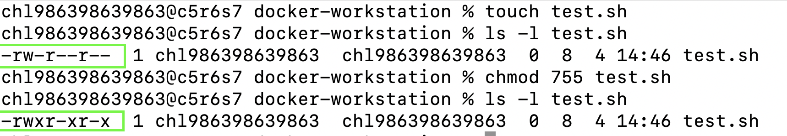


---

<a id="eval-docker-status"></a>

## Docker 설치 및 기본 점검
Docker 명령어를 사용하기 전에 **OrbStack을 실행**한다.

### Docker 버전 확인
OrbStack 실행 후 Docker CLI가 정상적으로 동작하는지 확인
```bash
docker --version
```
* 실행 결과
```bash
Docker version 28.5.2, build ecc6942
```

### Docker Engine 동작 확인

Docker Engine(데몬)이 정상적으로 실행 중인지 확인한다.

#### 실행 명령

```bash
docker info
```

#### 실행 결과

```text
...
Server:
 Server Version: 28.5.2
...
```

`Server` 정보가 출력되면 Docker Engine이 정상적으로 실행 중인 것을 의미한다.

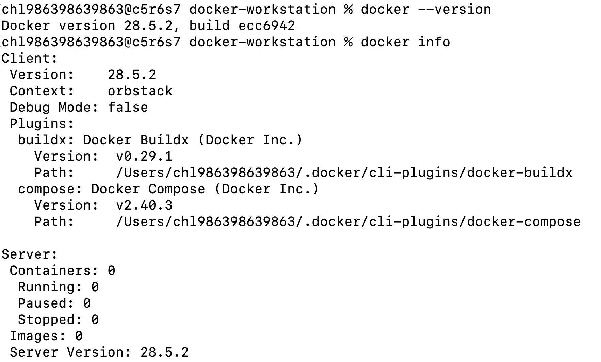

### Docker Context 확인
(목적)
OrbStack 사용 시 OrbStack Context가 활성화되었는지 확인
Docker Desktop 사용 시 적절한 Context가 활성화되었는지 확인
```bash
# 현재 Docker Context 확인
docker context ls
# 현재 선택된 Context 확인
docker context show
```
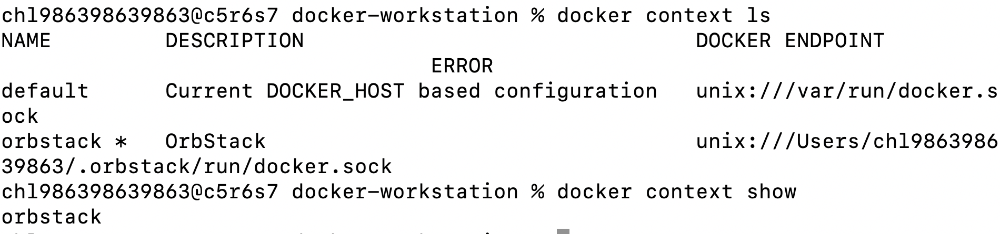

---

<a id="eval-docker-management"></a>

## Docker 기본 운영 명령 수행 & 컨테이너 실행 실습

### Ubuntu 이미지 다운로드
Docker Hub에서 Ubuntu 이미지를 다운로드

```bash
docker pull ubuntu
```
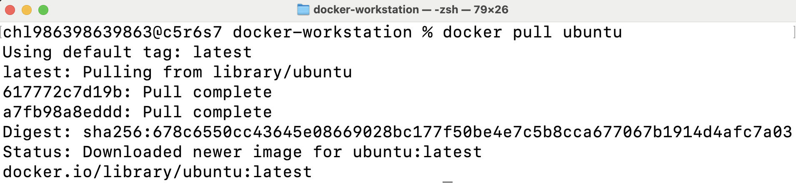

### 이미지 목록 확인

```bash
# 다운로드된 이미지 확인 명령
docker images
```
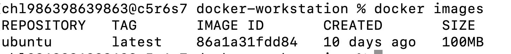

<a id="eval-hello-world"></a>

### hello-world 실행

```bash
# 도커가 정상 설치, 작동되는지 기본적인 테스트 명령어
docker run hello-world
# 실행하면 일어나는 일
# 1. hello-world 실행해줘
# 2. hello-world 이미지가 있는지 확인함
# 3. Docker hub로 요청함 -> 다운로드
# 4. 이미지 기반으로 컨테이너 생성 및 실행
# 5. "Hello from Docker" 안내 문구 출력 후 종료
```
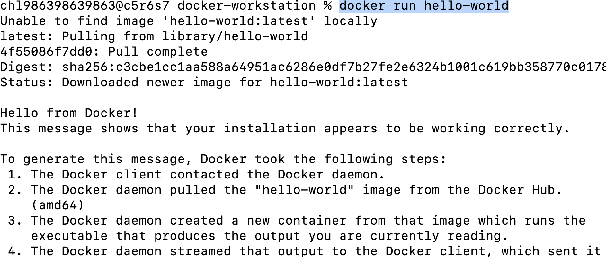

### Ubuntu 컨테이너 실행

```bash
# 우분투 이미지로 ubuntu-test라는 새 컨테이너를 생성하고,
# 터미널 입력이 가능한 bash 셸을 실행해 내부 접속
docker run -it --name ubuntu-test ubuntu bash

#docker run 명령은 컨테이너 생성 + 시작
# 새 컨테이너 생성하고 즉시 실행해라
# -i 옵션: 컨테이너 표준 입력을 열린 상태로 유지(사용자 키보드 입력 받을 수 있게 함)
# -t 옵션: 컨테이너 내부에 터미널 화면을 제공함
# --name: 새로 생성하는 컨테이너 이름 지정
# (지정하지 않을 시 도커가 임의 부여함)
# 컨테이너 ID 대신 이 이름을 명령으로 사용할 수 있음
```

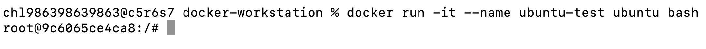

### 컨테이너 내부 명령

```bash
# 현재 디렉터리 목록 확인
ls
# 문자열 출력
echo "Hello Docker"
# 컨테이너 종료
exit
```
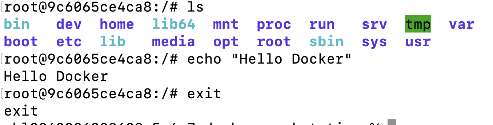

### 실행 중인 컨테이너 확인

```bash
docker ps
```
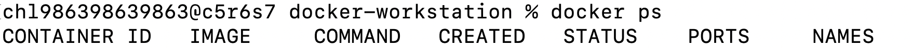

### 전체 컨테이너 확인

```bash
# 종료된 컨테이너까지 포함하여 확인함
docker ps -a
```
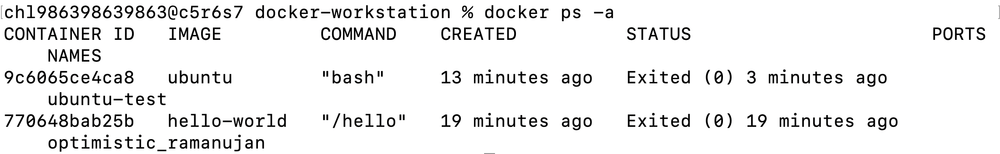

### 컨테이너 다시 시작

```bash
# docker start 컨테이너이름(또는 컨테이너ID)
docker start ubuntu-test
```
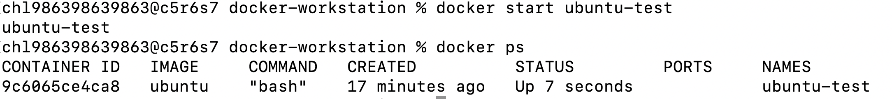

### attach 실습
* 종료 시 메인 프로세스를 종료시키면서 밖으로 나옴
```bash
# 실행 중인 컨테이너의 메인 프로세스에 밀착(연결)
# 컨테이너가 원래 실행 중인 화면에 다시 붙는 것
# 그래서 attach로 내부로 들어가서 exit(종료)하면
# 메인 프로세스 종료 -> 컨테이너 종료
docker attach ubuntu-test

```

### exec 실습
* 종료 시 컨테이너를 끄지 않고 백그라운드에서 계속 돌린 채(유지) 빠져나옴
```bash
# 실행 중인 컨테이너 내부에서 새로운 프로세스 실행
# 실행 중인 컨테이너 안에서 새 명령을 하나 더 실행
# 이건 새로 만들어서 종료 시키는거라서 메인은 살아있음
docker exec -it ubuntu-test bash
```

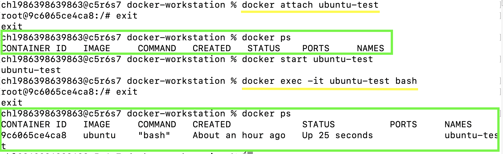

### attach / exec 차이
* 둘 다 실행 중인 컨테이너 내부로 들어가는 명령이지만 어떻게 들어가느냐 차이가 있음
* 실무에서는 exec를 많이 사용함
* 메인으로 붙어서 들어가면 컨테이너 종료,,(-> 서비스 죽음)이라서,,
* 보통은 컨테이너 안으로 직접 들어가는 자체를 잘 안한다고,,수정 필요하면 Dockerfile 수정, 새 이미지 빌드, 새 컨테이너 배포

```text
[ attach (앞문) ]                              [ exec (옆문) ]
  메인 프로세스 화면에 직접 밀착                  독립된 새 터미널(Bash)을 하나 더 생성

┌────────────────────────────┐                ┌────────────────────────────┐
│ Container                  │                │ Container                  │
│ ┌────────────────────────┐ │                │ ┌────────────────────────┐ │
│ │ 메인 프로세스 (PID 1)   │ │                │ │ 메인 프로세스 (PID 1)   │ │
│ └───────────▲────────────┘ │                │ └────────────────────────┘ │
│             │              │                │ ┌────────────────────────┐ │
│         내 터미널           │                │ │ 새 Bash 프로세스        │ │<── 내 터미널
└────────────────────────────┘                │ └────────────────────────┘ │
                                              └────────────────────────────┘
 (여기서 exit 치면 전체 셧다운!)                    (여기서 exit쳐도 메인은 안 죽음!)
```

| attach | exec |
|---------|------|
| 기존 메인 프로세스에 연결 | 새로운 프로세스를 실행 |
| 메인 프로세스 종료 시 컨테이너도 종료될 수 있음 | 독립적으로 셸을 실행 |
| 거의안씀..(학습용) | 가장 많이 사용하는 방식 |

### 로그 확인
(오류 발생 확인)
* 컨테이너 안의 로그 파일 아니다..
* 예) 스프링부트 애플리케이션 log.info("로그인 성공")
* 콘솔(stdout) 이걸 Docker가 가로채서 Host(Docker 실행하고 있는 컴퓨터, 컨테이너 내부가 아니고,,) Docker 관리 영역에 저장함(컨테이너 삭제시 같이 삭제됨)

```bash
docker logs ubuntu-test
```
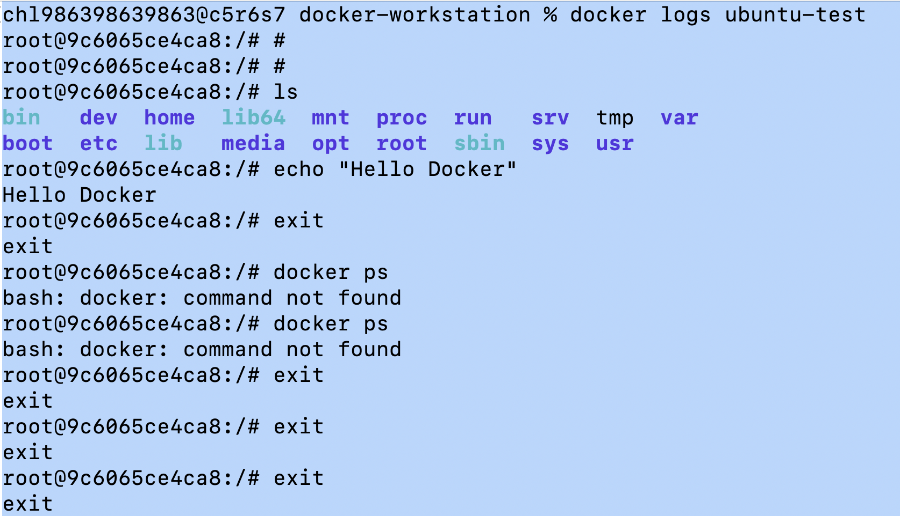

### 리소스 확인
* 컨테이너가 컴퓨터 자원을 얼마나 사용하는지 확인하는 것
* 실행 중인 컨테이너의 CPU, 메모리, 네트워크 및 디스크 I/O 사용량을 확인한다.
* 왜 확인? 컨테이너 느린 이유, 죽은 이유, 서버 버벅 이유, 메모리 부족 여부, CPU 과부화 여부 확인용
* 로컬 개발이나 작은 서버에서 본다고 함
* 큰 회사는 보통 프로메테우스, 그라파나 같은 모니터링 도구로 본다고,,
  
```bash
docker stats
```

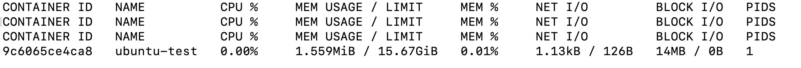

```shell
서비스가 느리다는 신고 들어오면
docker ps # 컨테이너 살아있니?
docker logs 컨테이너이름 # 로그 확인
docker stats 컨테이너이름 # 실시간 자원 사용량 확인
docker inspect 컨테이너이름 
# 컨테이너 모든 세부 설정 및 메타 데이터 JSON 형식으로 봄
```

### docker 디스크 사용량 확인
* Docker를 오래 사용하면 이미지, 컨테이너, 볼륨, 빌드 캐시 이런게 계속 쌓임 그래서 도커가 용량 얼마나 먹고 있는지 확인함
```bash
# df: disk free의 약자
docker system df
```
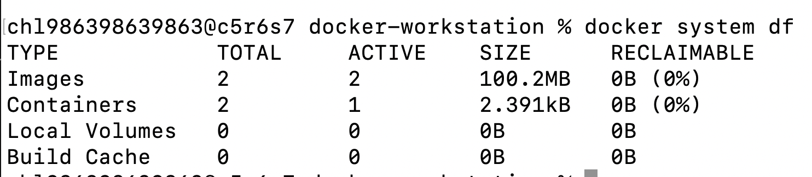

### 컨테이너 중지

```bash
docker stop ubuntu-test
```
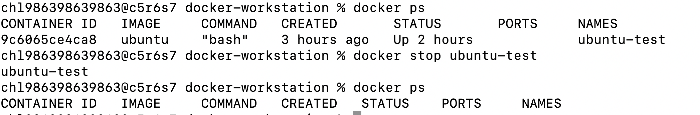

### 컨테이너 삭제

```bash
docker rm ubuntu-test
```

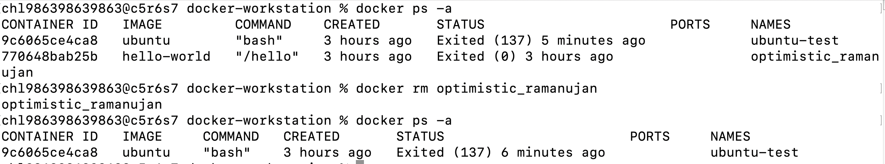

### 이미지 삭제
* (멈춰있는 컨테이너 포함)해당 이미지로 생성된 컨테이너가
  단 하나라도 존재하면 이미지 삭제가 안됨
* 귀찮으면 강제옵션(-f) 사용 -> 컨테이너 연결 끊기 + 이미지 삭제 강제로 한 번에 처리
```bash
# docker rmi 이미지명 또는 이미지ID
docker rmi ubuntu
```

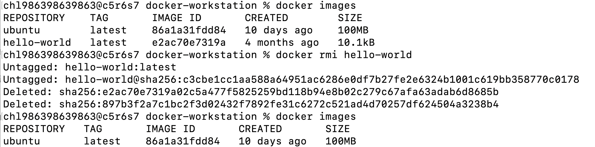

---

<a id="eval-image-container"></a>

## 이미지와 컨테이너의 차이
Docker 이미지는 컨테이너를 만들기 위한
읽기 전용 템플릿이고,
컨테이너는 이미지를 실제로 실행하여 생성한
실행 가능한 인스턴스이다.

**빌드관점**
* 이미지: Dockerfile기반으로 docker build를 실행하여 생성됨
* 컨테이너: 빌드된 이미지로부터 생성됨

**실행관점**
* 이미지: 
  * 이미지 자체는 실행 중인 프로세스가 아님
  * 하나의 이미지로 여러 컨테이너 생성 가능
* 컨테이너:
  * 이미지로부터 생성되어 실제 프로세스를 실행함

**변경관점**
* 이미지: 
  * 생성된 이미지는 기본적으로 읽기 전용
  * 이미지 내용을 영구적으로 바꾸려면 원본 파일이나 Dockerfile을 수정한 뒤 다시 빌드해야함
* 컨테이너:
  * 컨테이너는 이미지 위에 쓰기 가능한 계층이 추가됨
  * 실행 중 파일 수정할 수 있으나, 그 변경은 컨테이너 안에서만 적용되는 것

---

<a id="eval-docker-build"></a>

## Dockerfile 기반 커스텀 이미지 제작

### (A) 웹 서버 베이스 이미지 활용(예: NGINX/Apache 등) + 정적 콘텐츠/설정만 교체

#### app/index.html 생성
```bash
# 프로젝트 루트에 app 디렉터리 생성
mkdir app
touch app/index.html # 정적 html 파일 생성
```

#### app/index.html 작성
다음과 같이 VS Code 작성함
```bash 
cat app/index.html # 내용 확인
```
```html
<!doctype html>
<html lang="ko">
<head>
    <meta charset="UTF-8">
    <meta
        name="viewport"
        content="width=device-width, initial-scale=1.0"
    >
    <title>Docker Workstation</title>
</head>
<body>
    <h1>Docker Workstation Assignment</h1>

    <p>Custom Nginx image is running successfully.</p>

    <ul>
        <li>Base image: nginx:alpine</li>
        <li>Application version: 1.0</li>
        <li>Environment: development</li>
    </ul>

    <p id="mount-message">
        This page was copied into the Docker image.
    </p>
</body>
</html>% 
```

#### .dockerignore 작성
* 도커 이미지를 만들 때 현재 폴더 전체를 Docker에게 보내는 명령을 치는데, 안에 있는 파일들을 전부 압축해서 도커 엔진으로 보내게 됨
  이걸 Build Context라고 함
  그럼 문제가 뭐냐.. 현재 프로젝트 안에
  `.git`, `assets`, `README.md` 같은 것들도 있음
  이것들은 Docker 이미지 만들 때 필요가 없다,,
  즉, 필요 없는 것까지 도커 엔진으로 보내져서
  이미지를 찍게 되면 불필요 + 빌드 느려짐
  그래서 .dockerignore를 작성하는 것!
* Docker에게 보내지 말아야할 파일 목록
(도커가 이미지 빌드할 때 포함시키지 않을 목록)
* .dockerignore는 불필요한 파일이 Docker 빌드 엔진으로 전송되는 것을 막는다.

프로젝트 루트에 작성한다.

```bash
touch .dockerignore
```

내용: 
```text
.git/
README.md
assets/
.vscode/
.idea/
.DS_Store
```

#### .gitignore와 .dockerignore 차이
| 항목    | `.gitignore`       | `.dockerignore`                     |
| ----- | ------------------ | ----------------------------------- |
| 대상    | Git                | Docker Build                        |
| 목적    | Git에 추적하지 않을 파일 지정 | Docker Build Context에 포함하지 않을 파일 지정 |
| 적용 시점 | `git add`          | `docker build`                      |
| 효과    | Git 저장소에 올라가지 않음   | Docker Engine으로 전송되지 않음             |

---

### Dockerfile 작성
* Docker 파일이란? 
  * docker 이미지를 만드는 절차를 작성한 텍스트 파일
  * docker는 이 파일을 위에서 아래로 읽고, 베이스 이미지 위에 파일 복사, 패키지 설치, 환경 변수 설정, 실행 명령 같은 작업을 적용하여 새 이미지를 만든다. 
  * docker 공식 문서에서도 Dockerfile을 컨테이너 이미지를 만들기 위한 명령을 담는 텍스트 문서로 설명함
  * 도커파일에 적힌 명령어들을 한 줄씩 순서대로 실행해서 최종 도커 이미지를 만드는 것 (컨테이너를 만들 이미지의 제작 설명서)

```bash
Dockerfile
이미지를 만드는 제작 설명서
        ↓ docker build

Docker Image
컨테이너 실행에 필요한 읽기 전용 템플릿
        ↓ docker run

Docker Container
이미지를 실제로 실행한 인스턴스

```

프로젝트 루트에서 Dockerfile 생성
(다른 이름도 가능하지만 그럼 빌드할 때 직접 지정해야 함)
```bash
touch Dockerfile
```

내용:
```Dockerfile
# FROM: 어떤 베이스 이미지에서 시작할지 지정함
# 정적 HTML 페이지를 서비스하는 웹 서버를 만드는 것이 목표여서
# 공식 Nginx 이미지 중 Alpine Linux 기반 경량 이미지 사용
# 엔진엑스는 웹서버 프로그램
FROM nginx:alpine

# 이미지의 이름, 목적을 식별하기 위한 OCI 표준 메타데이터를 추가한다.
LABEL org.opencontainers.image.title="docker-workstation-web"
LABEL org.opencontainers.image.description="Custom Nginx image for Docker workstation assignment"

# ENV: 환경변수 설정
# 현재 이미지가 어떤 실행 환경(개발, 검증, 운영 등)에서 동작하는지
# 컨테이너 내부에서 환경 정보 확인 가능
ENV APP_ENV=development

# Host의 app/ 폴더 안에 있는 정적 파일을
# 이미지 내부의 엔진엑스 기본 웹 문서 경로로 복사함
# COPY: 컴퓨터에 있는 소스코드나 파일을 이미지 내부로 복사
COPY app/ /usr/share/nginx/html/

# 컨테이너가 80번 포트를 사용한다는 정보 기록
# 이건 메타데이터일 뿐,,
# 실제 포트 매핑이 필요함
EXPOSE 80

# 헬스체크: 컨테이너가 실제로 살아있는지
# 주기적으로 체크하는것
# 10초마다 localhost로 요청 보내서 
# 반응이 3초 내에 안오면 실패로 간주
# 연속 3번 실패시 컨테이너 상태를 unhealthy로 변경
HEALTHCHECK --interval=30s --timeout=3s --start-period=5s --retries=3 \
    CMD wget -qO- http://localhost/ || exit 1
```

#### Dockerfile 명령 설명
| 명령            | 역할                  |
| ------------- | ------------------- |
| `FROM`        | 베이스 이미지 지정          |
| `LABEL`       | 이미지 메타데이터 기록        |
| `ENV`         | 컨테이너 내부 환경 변수 설정    |
| `COPY`        | 호스트 파일을 이미지 내부로 복사  |
| `EXPOSE`      | 컨테이너가 사용하는 포트 정보 기록 |
| `HEALTHCHECK` | 서비스 정상 동작 여부 검사     |

> EXPOSE 80은 이미지가 80번 포트를 사용한다는 메타데이터일 뿐이다. 호스트에서 접속하려면 docker run -p 호스트포트:컨테이너포트 방식의 실제 포트 매핑이 필요하다.

---

### 커스텀 이미지 빌드
Dockerfile이 있는 프로젝트 루트에서 실행함
```bash
# 커스텀 이미지 빌드
# docker build [옵션] <빌드 컨텍스트>
docker build -t codyssey-web:1.0 .
# docker: docker CLI 실행
# build: Dockerfile을 이용해 이미지 생성 명령
# -t: 생성할 이미지의 이름(Tag)을 지정하는 옵션
# codyssey-web:1.0 이미지 이름과 태그
# . : 현재 디렉터리를 빌드 컨텍스트로 사용(-> 도커엔진으로 보냄)
# 빌드 컨텍스트: docker가 이미지를 만들 때 접근할 수 있도록 넘겨주는 파일 범위(이 범위에 있는 걸로 이미지 빌드에 사용하게 넘긴다)
```
**명령 전체를 한 문장으로 해석하면**
현재 디렉터리(.)의 Dockerfile을 이용하여 Docker 이미지를 생성하고, 생성된 이미지의 이름을 codyssey-web, 태그를 1.0으로 지정한다.

* 실행결과:
현재 디렉터리의 `Dockerfile`을 기반으로 `codyssey-web:1.0` 이미지가 생성된다.

```text
현재 디렉터리(.)
        ↓
.dockerignore 확인
        ↓
제외되지 않은 파일을 빌드 컨텍스트로 구성
        ↓
Dockerfile의 COPY, ADD에서 사용
        ↓
이미지 생성

```

#### 이미지 생성 확인
```bash
docker images 
# 또는
docker images codyssey-web
docker image ls codyssey-web 
```
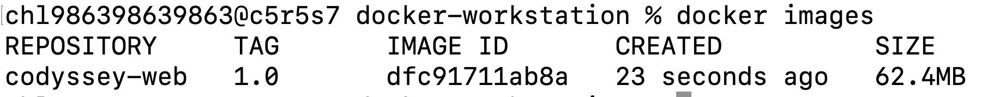

---
<a id="eval-port-mapping"></a>

### 포트 매핑 실습
커스텀 이미지를 호스트 8080 포트에 연결
```bash
docker run -d \
  --name codyssey-web-8080 \
  -p 8080:80 \
  codyssey-web:1.0
  # docker run: 새로운 컨테이너를 생성하고 실행
  # 지정한 이미지가 local에 존재하지 않으면
  # 자동으로 docker hub 같은 저장소에서 pull 받은 뒤 실행함
  # -d: 백그라운드에서 실행한다는 옵션
  # --name: 실행될 컨테이너에 이름 부여
  # 설정 안할 시 임의로 부여됨
  # -p: 8080:80 포트포워딩 host컴퓨터의 8080포트와
  # 컨테이너 내부의 80포트를 연결함
  # 도커 컨테이너 내부 네트워크는 기본적으로 외부와 격리되어있음
  # 사용자가 브라우저 주소창에 http://localhost:8080으로 접속하면
  # 호스트의 8080번 포트가 이 요청을 받아서
  # 컨테이너 내부의 80포트로 전달해줌
  # codyssey-web:1.0 컨테이너로 생성할 이미지 이름, 태그번호
```

```bash
chl986398639863@c5r5s7 docker-workstation % docker run -d --name codyssey-web-8080 -p 8080:80 codyssey-web:1.0
e8745cc3935b26c1aa5145b1e9c5627d82820225c7dbdf9cf11328d4e887af5c
chl986398639863@c5r5s7 docker-workstation % docker ps
CONTAINER ID   IMAGE              COMMAND                   CREATED          STATUS                    PORTS                                     NAMES
e8745cc3935b   codyssey-web:1.0   "/docker-entrypoint.…"   11 seconds ago   Up 14 seconds (healthy)   0.0.0.0:8080->80/tcp, [::]:8080->80/tcp   codyssey-web-8080
```

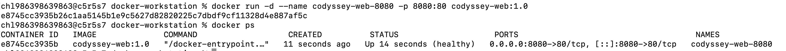


- 이 이미지는 nginx:alpine을 기반으로 했기 때문에,
컨테이너가 시작될 때 Nginx 웹 서버가 실행됨
```bash
# 흐름
codyssey-web:1.0 이미지
        ↓
새 컨테이너 생성
        ↓
Nginx 실행
        ↓
컨테이너 내부 80번 포트에서 대기
        ↓
호스트의 8080 포트와 연결

-p 8080:80
   │    │
   │    └─ 컨테이너 내부 포트
   └────── 호스트 포트

# 그래서 브라우저에서 다음 주소로 접속하면
http://localhost:8080
# 컨테이너 안의 엔진엑스가 다음 파일을 응답함
/usr/share/nginx/html/index.html
# 이 파일은 Dockerfile의 COPY로 복사했던
app/index.html
```

#### 브라우저 접속
주소

```text
http://localhost:8080
```
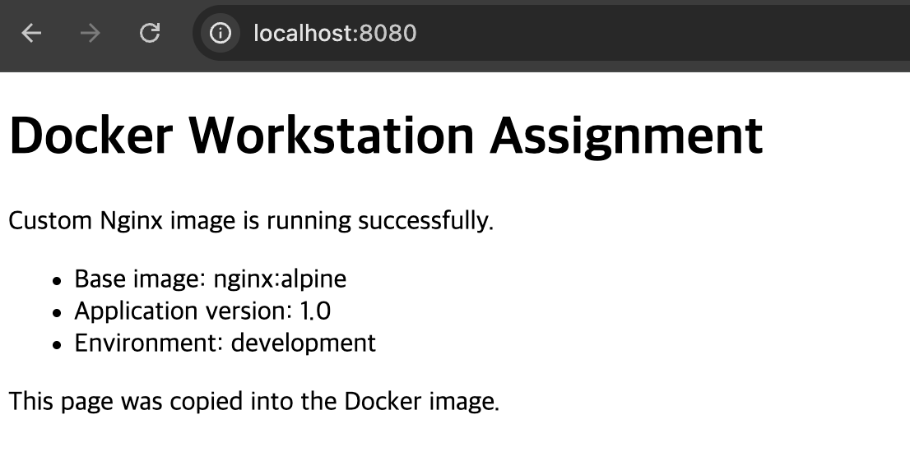

#### curl 접속 확인
컬이라고 읽음 클라이언트 URL의 줄임말
curl은 브라우저 없이 HTTP 요청을 보내는 프로그램
브라우저는 HTML을 예쁘게 화면 출력(렌더링)
curl은 HTML 그대로 터미널에 출력

```bash
curl -i http://localhost:8080
```

실행 결과

```text
HTTP/1.1 200 OK
Server: nginx/1.31.3
Date: Wed, 05 Aug 2026 09:14:02 GMT
Content-Type: text/html
Content-Length: 565
Last-Modified: Wed, 05 Aug 2026 05:23:35 GMT
```

#### 두 번째 컨테이너: 8081 포트

같은 이미지로 두 번째 컨테이너를 실행
```bash 
# docker run: 이미지에서 컨테이너생성 + 실행
# -d: 백그라운드에서 실행
docker run -d --name codyssey-web-8081 -p 8081:80 codyssey-web:1.0

# 컨테이너 확인
docker ps
```
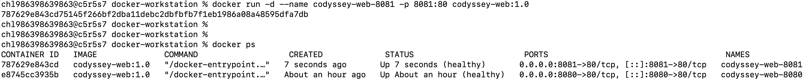
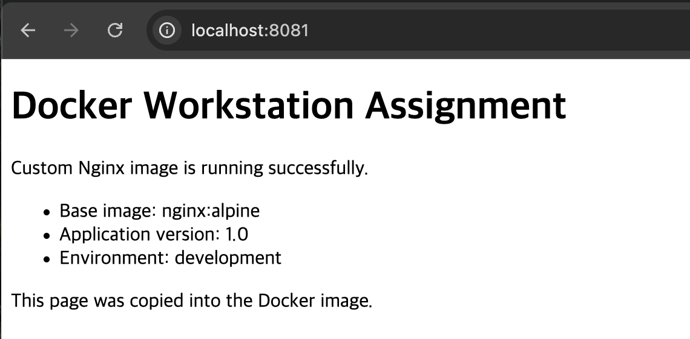

> - 서로 다른 호스트 포트를 사용하면 동일 이미지의 컨테이너를 여러 개 실행할 수 있다.
> - 동일한 호스트 포트는 동시에 두 컨테이너가 사용할 수 없다.

---

<a id="eval-port-concept"></a>

### 컨테이너 내부 포트에 직접 접속할 수 없는 이유

* 컨테이너는 호스트와 네트워크가 분리되어 있기 때문
* 도커 컨테이너는 호스트와 분리된 독립적인 네트워크 공간에서 실행됨
* 그래서 호스트 컴퓨터의 브라우저는 그 포트에 직접 접근할 수 없음,,
컨테이너 내부 포트는 컨테이너 내부 네트워크에서만 유효한 주소이기 때문
* 호스트의 localhost:80과 컨테이너의 localhost:80은 서로 다른 네트워크 공간임
그래서 호스트에서 컨테이너의 80번 포트로 직접 접속 못함
* 그래서 도커는 포트 매핑을 제공하는 것

```text
Host(macOS)
┌──────────────────────────┐
│ localhost:8080           │
└─────────────┬────────────┘
              │
       Docker Port Mapping
              │
              ▼
Container
┌──────────────────────────┐
│ nginx                    │
│ localhost:80             │
└──────────────────────────┘
```

---

<a id="eval-port-troubleshooting"></a>

### 호스트 포트가 이미 사용 중이라 포트 매핑이 실패한다면 어떻게 진단할까?

**1. 오류 메시지 확인**
  Docker가 출력한 오류 메시지 확인
**2. Docker 컨테이너가 포트를 사용중인지 확인**
  `docker ps`명령으로 실행 중인 컨테이너 중 해당 포트를 사용중인 컨테이너가 있는지 확인한다. 
**3. 호스트에서 어떤 프로세스가 사용하는지 확인**
  (macOS/Linux기준) 
  `lsof -i :포트번호`를 실행하면
  어떤 프로그램이 포트를 점유하는지 확인 가능함
**4. 원인에 맞게 조치**
  기존 Docker 컨테이너가 사용하고 있는 경우
  중지 또는 삭제한다.
  다른 프로그램이 사용하고 있는 경우
  프로그램을 종료하거나, 다른 포트를 사용한다
**5. 다시 실행하여 확인**
  다시 컨테이너를 실행해서 포트포워딩한다.

```bash
포트 매핑 실패
        │
        ▼
오류 메시지 확인
        │
        ▼
docker ps
        │
        ▼
docker port
        │
        ▼
lsof -i :8080
        │
        ▼
포트 점유 프로그램 확인
        │
        ▼
컨테이너 종료 또는 다른 포트 사용
        │
        ▼
다시 docker run
```

---

## 바인드 마운트 변경 반영 실습

### 바인드 마운트란?
- 호스트 컴퓨터의 실제 파일이나 폴더를 컨테이너 내부 경로에 직접 연결하는 기능
- 파일을 이미지 안으로 복사하는 것이 아니라 실시간으로 연결함
- Dockerfile의 `COPY`와 차이
  - COPY는 이미지를 빌드할 때 파일을 이미지 내부에 복사한다
  - 그래서 호스트 파일 수정해도 기존 이미지에는 반영이 안됨
  - 반영 시키려면 docker build 다시해서 이미지 다시 만들고
  - 컨테이너도 다시 만들어야 함
- 바인드 마운트로 호스트 폴더와 컨테이너 폴더를 직접 연결하면?
  - 호스트 파일 수정 시 컨테이너에서 즉시 반영 되어 보임
  - 이미지 재빌드 필요없음
  - 컨테이너 재생성 필요없음
  - 로컬 개발 환경에서 많이 사용된다고 함
  (개발 중엔 파일을 계속 수정하기 때문에,,)
  - 운영에서는 거의 안함..
    - COPY로 넣음 (버전관리, 안정성, 재현성)

```bash
# 개발
내 PC

app/
     │
     ▼
Bind Mount
     │
     ▼
Container
```

```bash
# 운영
Git

↓

CI/CD

↓

docker build

↓

Image

↓

Container
```

### 바인드 마운트 준비
바인드 마운트 컨테이너가 8080울 사용할 예정이므로
위에서 생성했던 기존 8080 컨테이너 삭제함
```bash
# -f: 강제 옵션, 실행중인 컨테이너 원래 삭제 못하고 중지해야 가능
# 귀찮으니 그냥 강제(force) 즉시 종료하고 삭제함
docker rm -f codyssey-web-8080
```

### 바인드 마운트 컨테이너 실행
프로젝트 루트에서 실행해야 ${pwd}가 올바른 경로를 가리킴
```bash
# 문법: -v 호스트경로:컨테이너경로:옵션
# ${pwd}/app 호스트 컴퓨터의 app폴더 경로
# /usr/share/nginx/html 
# 컨테이너 내부 엔진엑스 웹 문서 폴더
# ro 
# read-only, 컨테이너는 읽기만 가능
# 컨테이너 내부에서 웹파일 수정 못하게 막음
# 호스트에서만 파일 변경 가능하게
# 실수로 컨테이너에서 수정, 삭제 못하게 막은거
docker run -d \
  --name codyssey-bind-mount \
  -p 8080:80 \
  -v "$(pwd)/app:/usr/share/nginx/html:ro" \
  codyssey-web:1.0
  # 호스트 폴더와 컨테이너 폴더를 직접 연결
```

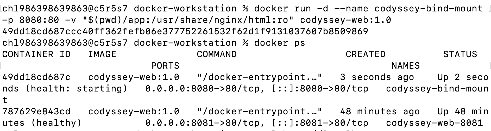

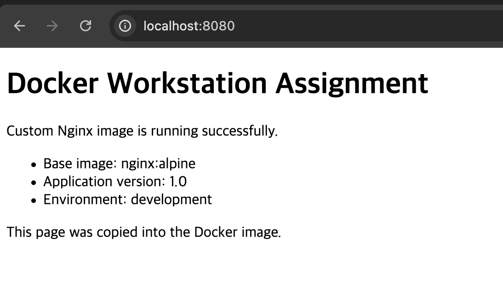

### 바인드 마운트 변경 반영 확인

`app/index.html`에서 수정 -> 새로고침

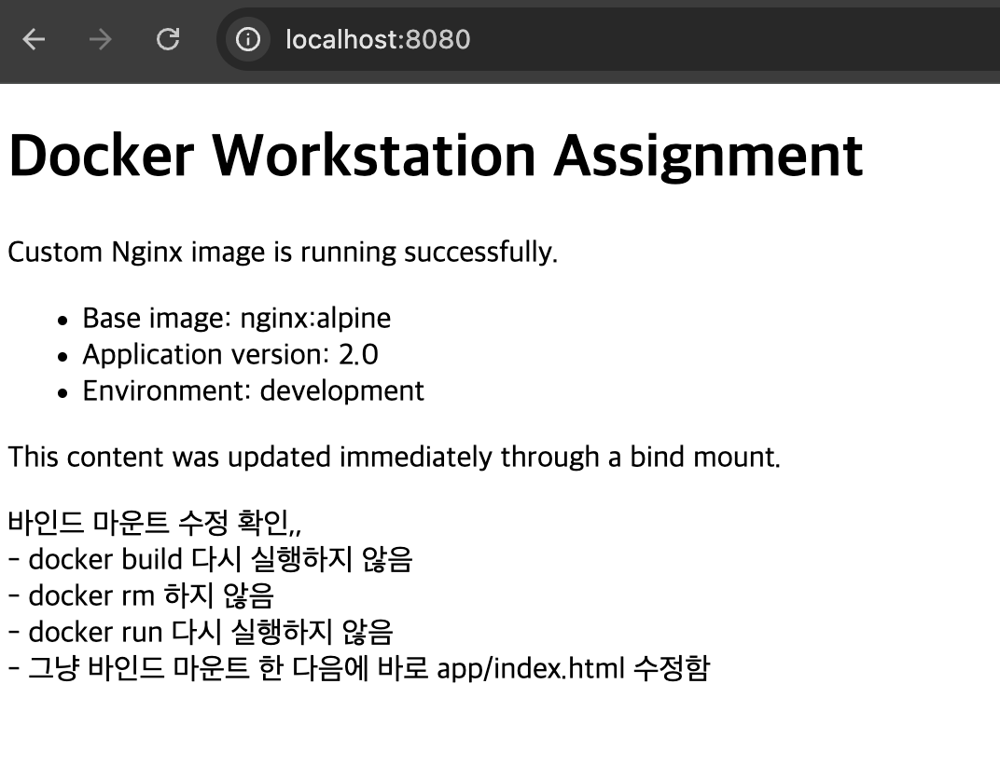

변경된 내용을 바로 확인 가능함

> 정리!
> 바인드 마운트는 호스트의 실제 파일이나 디렉토리를 컨테이너에 직접 연결한다
> 그래서 호스트 파일 변경이 컨테이너 내부에 즉시 반영된다
> 로컬 개발에서 소스코드 변경 확인에 자주 사용됨
> 호스트 경로에 의존하므로 다른 PC에서는 경로 수정해야 할 수 있음
> 지금은 그래도 하드 코딩을 줄이고자 $(pwd)를 사용하긴 했음
> :ro는 컨테이너에서 읽기 전용으로 마운트하는 옵션(실수로 컨테이너에서 수정, 삭제 못하게 일부러 막음)

---

<a id="eval-volume"></a>

## Docker 볼륨 영속성 실습
### 들어가기전 개념 정리
#### 영속성(Persistence)이란?
  * 프로그램이 종료되거나 컨테이너가 삭제되어도 데이터가 계속 유지되는 성질
  * 컴퓨터 재부팅해도 파일 그대로 있음 -> 영속성
  * 반대말은 휘발성
    * 컴퓨터를 끄는 순간 데이터 사라짐,,

#### Docker 컨테이너는 기본적으로 휘발성이다.
* 컨테이너 삭제 시 그 안의 데이터도 같이 삭제됨
* 이게 왜 문제인가?
  * 예) 데이터베이스를 컨테이너로 띄웠는데 삭제 하면,, DB에 저장되었던
  데이터 같이 날아감,,-> 서비스 망함..

->  그래서 도커 볼륨이 등장한 것

#### Docker Volume
volume: 컨테이너 밖에 데이터를 저장하는 공간
볼륨 안에 데이터를 저장시켜서
컨테이너를 삭제 해도
볼륨은 안지워짐 -> 데이터도 남아있음

새 컨테이너를 만들면? 같은 볼륨에 연결하면
데이터는 예전 그대로 -> 영속성

---

### Docker Volume 생성

```bash
docker volume create codyssey-data
```

목록 확인:

```bash
docker volume ls
```

상세 확인:

```bash
docker volume inspect codyssey-data
```

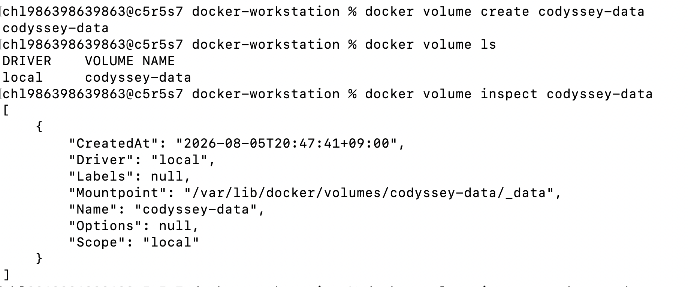

### 컨테이너에 Volume 연결
ubuntu:24.04 이미지로 volume-test-1이라는 컨테이너를 백그라운드에서 생성·실행하고, Docker Volume codyssey-data를 컨테이너 내부 /data에 연결한 뒤 sleep infinity 프로세스를 실행해 컨테이너가 종료되지 않도록 유지함
 ```bash
 # -v codyssey-data:/data
 # -v 볼륨이름:컨테이너내부경로
 # Docker Volume codyssey-data를 컨테이너의 /data에 연결
 # sleep infinity 무한 대기해라
 # 컨테이너를 계속 켜 두는 역할
 # 우분투 이미지는 엔진엑스처럼 계속 실행되는 서버 프로세스 포함하지 않아서 사용함
docker run -d \
  --name volume-test-1 \
  -v codyssey-data:/data \
  ubuntu:24.04 \
  sleep infinity
 ```

 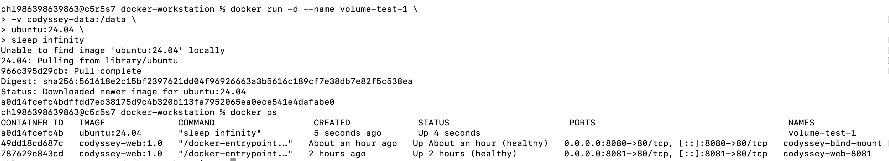

 ```bash
Docker Volume
codyssey-data
       │
       │ 연결
       ▼
컨테이너 내부
/data
 ```
 따라서 컨테이너 안(/data)에서 파일을 쓰면
 실제 데이터는 연결된 볼륨(codyssey-data)에 저장된다.

```bash
컨테이너 안에서 보이는 경로
/data/message.txt

실제 저장 대상
codyssey-data Volume
```

---

### Volume에 데이터 생성
```bash
# 컨테이너 내부 /data에 파일 생성
docker exec volume-test-1 \
  bash -lc "echo 'persistent data from container 1' > /data/message.txt"

# 생성된 파일 목록 확인
docker exec volume-test-1 \
  bash -lc "ls -la /data"
```

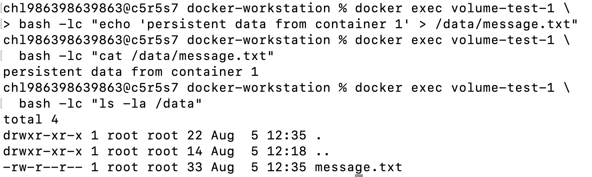

---

### 컨테이너 삭제
```bash
docker rm -f volume-test-1

# 삭제 확인(종료된 컨테이너까지 확인)
docker ps -a

# 볼륨 존재 확인
docker volume ls
```

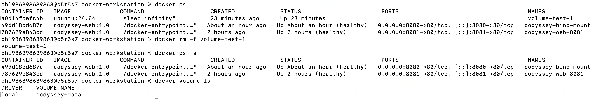

---

### 새 컨테이너에 동일 볼륨 연결

```bash
docker run -d \
  --name volume-test-2 \
  -v codyssey-data:/data \
  ubuntu:24.04 \
  sleep infinity
```

### Docker 볼륨 영속성 검증

새 컨테이너에서 기존 파일을 확인함

```bash
docker exec volume-test-2 \
  bash -lc "cat /data/message.txt"
```
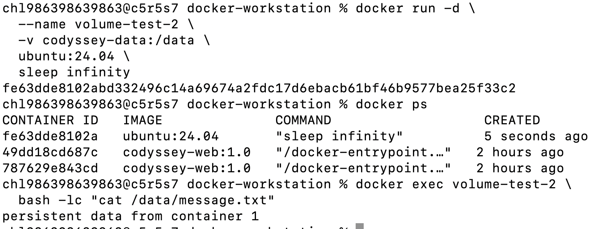

컨테이너 삭제 전/후로 데이터를 확인하여 데이터가 유지됨을 증명

> <볼륨 개념 정리>
> 볼륨 데이터는 컨테이너 파일 시스템과 별도로 관리된다
> 컨테이너가 삭제되어도 볼륨은 삭제 되지 않음
> 새로운 컨테이너에 동일 볼륨을 연결하면 기존 데이터를 다시 사용 가능
> 데이터베이스, 업로드 파일, 서비스 상태 데이터 저장에 적합

---

<a id="eval-data-loss"></a>

### 컨테이너 삭제 후 데이터가 사라진 경험과 대안
컨테이너는 기본적으로 삭제하면 내부 데이터도 함께 삭제됨
방지하는 방법은 Docker Volume을 사용하는 것.
컨테이너 실행 시 볼륨을 연결해서
이후 컨테이너 내부에서 생성된 파일은
컨테이너 외부의 볼륨에 저장되게 처리해서
컨테이너를 삭제해도 볼륨은 그대로 있음
그래서 새 컨테이너 생성 후 
동일한 볼륨을 연결하면 기존 데이터 그대로 사용이 가능함

---

<a id="eval-troubleshooting"></a>

## 트러블슈팅

Docker를 설치했는데도 docker --version을 실행하면 command not found: docker 오류가 발생했던 것

**1. 가설**  
처음에는 Docker가 제대로 설치되지 않았거나 환경변수가 잘못 설정됐나 싶었음  
**2. 확인**  
터미널을 종료한 뒤 오브스택을 먼저 실행하고  
다시 터미널을 열어서 확인  
`docker --version`  
도커 실행 파일 위치도 확인함  
`which docker`  
**3.조치**  
오브스택을 먼저 실행하고  
새로운 터미널 열음  
docker --version으로 정상 동작 확인  

**원인**은   
Docker CLI 자체는 OrbStack이 제공하기 때문에  
OrbStack이 실행되지 않으면  
Docker 실행 파일이 PATH에 연결되지 않아  
command not found 오류가 발행한 것..   
즉, Docker가 설치되지 않은 것이 아니라 OrbStack이 실행되지 않아 Docker CLI를 찾지 못했던 것  

**배운점**  
Docker명령은 단순히 설치 된다고 사용할 수 있는건 아니고  
도커 엔진이 실행 중이어야 하고  
Docker CLI가 정상적으로 연결되어 있어야 함  

